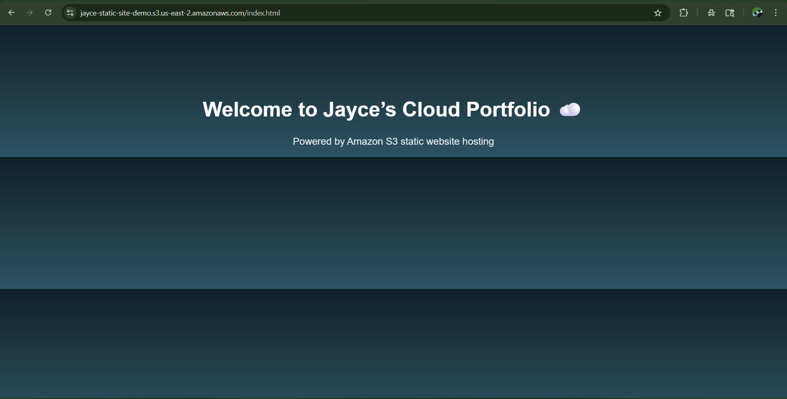
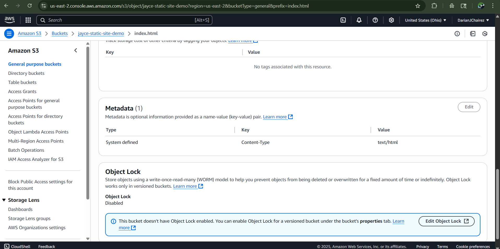
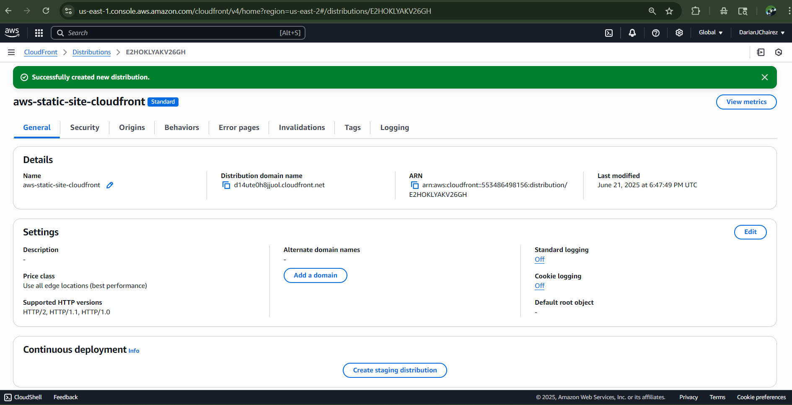

# AWS Static Website Hosting with CloudFront

## Overview
This project showcases a simple static website hosted on **Amazon S3** and globally accelerated with **CloudFront**. It highlights how to set up static hosting, configure public access, troubleshoot origin errors, and fine-tune metadata for proper HTML rendering.

## Architecture
- **Amazon S3** for static website hosting and object storage
- **IAM Bucket Policy** for public access
- **CloudFront** with a **custom origin** pointing to the S3 static website endpoint
- Responsive HTML/CSS layout to support a clean, modern design

## Deployment Steps
1. Created an S3 bucket and enabled static website hosting  
2. Uploaded `index.html` and other assets with appropriate `Content-Type` metadata  
3. Configured bucket policy for public read access  
4. Set up a CloudFront distribution:  
   - Selected **Custom Origin**  
   - Used the static site endpoint: `jayce-static-site-demo.s3-website.us-east-2.amazonaws.com`  
   - Left **Origin Path** blank to serve from root  
5. Validated the site through the CloudFront distribution domain

## Screenshots

### Live Site via CloudFront  

### S3 Bucket Policy Configuration  

### S3 Metadata Panel for HTML Rendering  

### CloudFront Distribution Settings  

## Key Learnings
- How CloudFront handles custom origins and origin paths  
- Fixing the `Origin DomainName` error by switching to **Custom Origin**  
- Importance of correct MIME types to render HTML properly

---

> A foundational project demonstrating real-world AWS cloud hosting, deployment troubleshooting, and static delivery optimization.
