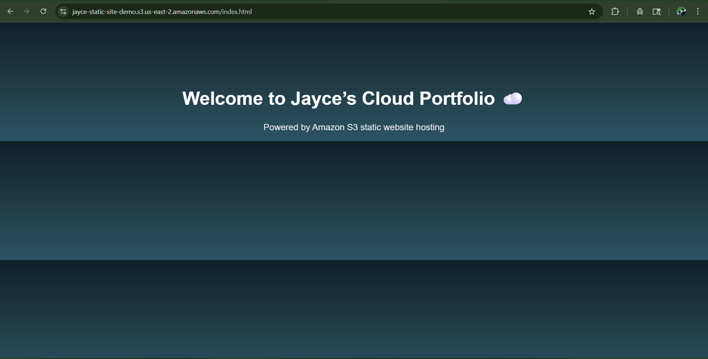

# 🌐 AWS Static Website Hosting with CloudFront
# 🌐 AWS Static Website Hosting with CloudFront

## 🚀 Overview
This project showcases a simple static website hosted on **Amazon S3** and accelerated globally using **CloudFront**. It highlights the process of configuring public access, setting correct metadata, and troubleshooting AWS-specific deployment errors.

## 🧱 Architecture
- **Amazon S3** for object storage and static website hosting
- **IAM Bucket Policy** for public read access
- **CloudFront** with a **custom origin** pointing to the S3 static website endpoint
- Responsive HTML/CSS design for clean presentation

## ⚙️ Deployment Steps
1. Created an S3 bucket and enabled static website hosting
2. Uploaded `index.html` and associated assets with proper `Content-Type` metadata
3. Applied a bucket policy to allow public access
4. Configured a CloudFront distribution:
   - Chose **Custom Origin**
   - Used S3 static site endpoint: `jayce-static-site-demo.s3-website.us-east-2.amazonaws.com`
   - Left **Origin Path** blank
5. Tested and validated website availability via CloudFront distribution URL

## 📸 Screenshots

### Live Site via CloudFront

### S3 Bucket Policy Configuration

### Metadata Panel in S3 for HTML Content

## 🧠 Key Learnings
- Difference between S3 **website endpoints** and **REST endpoints**
- How CloudFront handles custom origins and origin paths
- Importance of correct MIME types for HTML rendering
- How to troubleshoot AWS deployment errors like invalid `Origin DomainName`

---

> ✨ This project is part of my AWS Cloud Portfolio and demonstrates foundational cloud deployment skills with real-world relevance.
