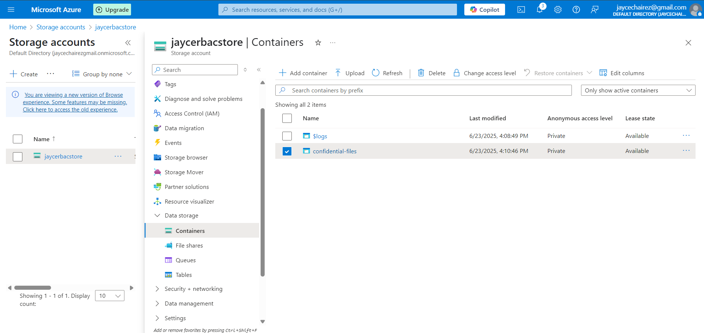
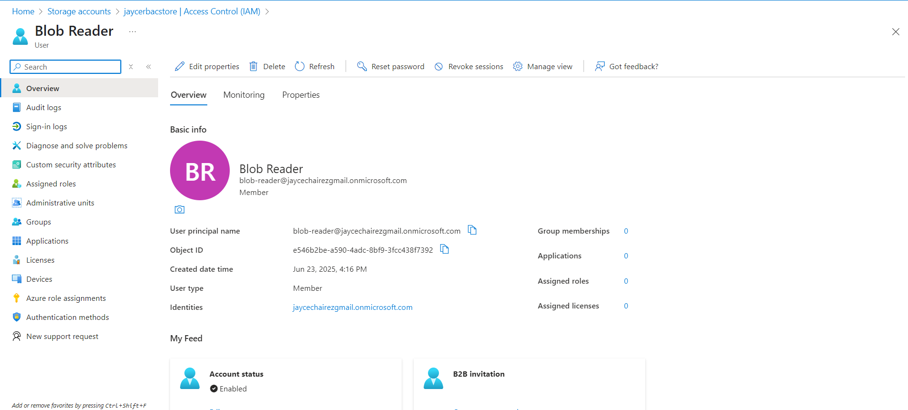
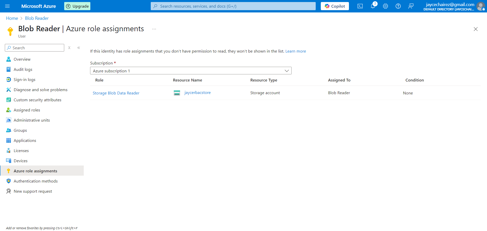
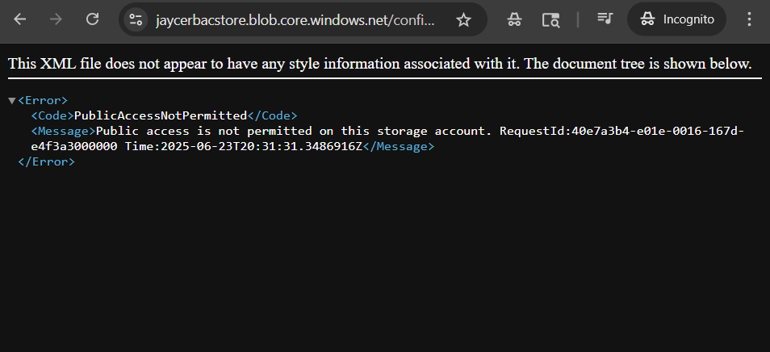

# Azure Storage + RBAC Access Control

## Overview
This project demonstrates how to securely configure Azure Blob Storage using Microsoft Entra ID and role-based access control (RBAC). A scoped test user is granted read-only access to a private container, simulating real-world identity governance and least-privilege enforcement in the cloud.

## Architecture
- **Azure Storage Account (Blob)** for secure, private object storage
- **Microsoft Entra ID (Azure AD)** to manage user identities
- **RBAC (Storage Blob Data Reader)** for fine-grained access control scoped to the storage account

## Deployment Steps
1. Created a storage account (`jaycerbacstore`) and a private blob container (`confidential-files`)
2. Created a test user (`blob-reader`) in Microsoft Entra ID without elevated privileges
3. Assigned the user the `Storage Blob Data Reader` role scoped to the storage account level
4. Validated the user's access:
   - Able to list and view blobs via Azure Portal
   - Blocked from uploading or deleting due to read-only role

## Screenshot

### Container View  

## Configuration Snapshots

### Microsoft Entra ID Test User  

### Role Assignment (IAM)  

### RBAC Access Test (Read Attempt Blocked)  

## Outcome
This project validates secure access design through RBAC in Azure. By configuring private blob storage and limiting permissions to a single scoped user, it demonstrates practical cloud identity management, role assignment, and access validation—key skills for junior cloud engineering roles.

## Tools Used
- Microsoft Azure Portal  
- Microsoft Entra ID (Azure Active Directory)  
- RBAC role assignment  
- GitHub for version control  
- Windows (local environment testing)

