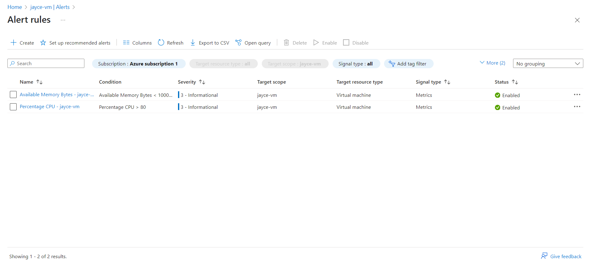

# ☁️ Azure VM Monitoring & Alerting

## Overview
This project provisions a secure Ubuntu 24.04 virtual machine on Microsoft Azure, installs a web server (Apache2), and configures Azure Monitor to generate real-time alerts for CPU and memory thresholds. It demonstrates infrastructure deployment, observability configuration, and operational validation through live system stress testing. A great showcase of cloud monitoring and incident response readiness.

## Architecture
- **Azure Virtual Machines** for hosting the web server
- **Apache2** for serving live HTTP content to the internet
- **Azure Monitor & Insights** for collecting metrics and health data
- **Action Groups** for automated email notifications on alert triggers
- **RBAC** used for VM-level access and scoped alerting
- SSH key pair authentication for secure Linux access

## Deployment Steps
1. Created a new Azure Resource Group `jayce-vm_group`
2. Deployed a Ubuntu 24.04 B1s VM with inbound SSH and HTTP allowed
3. Installed and started Apache2 to serve a default web page
4. Enabled Azure Monitor via Insights and installed monitoring agents
5. Configured alert rules: CPU > 80% and memory < 1GB using recommended templates
6. Simulated CPU stress with `stress` to trigger and verify alerts
7. Validated alert notification via Azure Portal and email

## 🔗 Live Site or Result
[View the deployed site](http://<your-public-ip>)  
_or_  
[View demonstration screenshot](./assets/demo.png)

## 📸 Screenshot

### Home Page or Primary View

## 🔍 Configuration Snapshots

### VM Overview

### Alert Rule Configuration

### Azure Monitor Alert Fired

## Outcome
This project simulates real-world monitoring scenarios by combining infrastructure deployment with alert automation. It helped reinforce cloud observability, diagnostics, and stress testing in a practical, production-like Azure environment. The ability to trigger and verify performance alerts makes it a valuable addition to any cloud engineering portfolio.

## Tools Used
- Microsoft Azure (Virtual Machines, Monitor, Action Groups)
- Apache2 Web Server
- stress (CPU simulation)
- SSH (terminal access)
- GitHub for version control
- Windows 11 (local dev environment)
