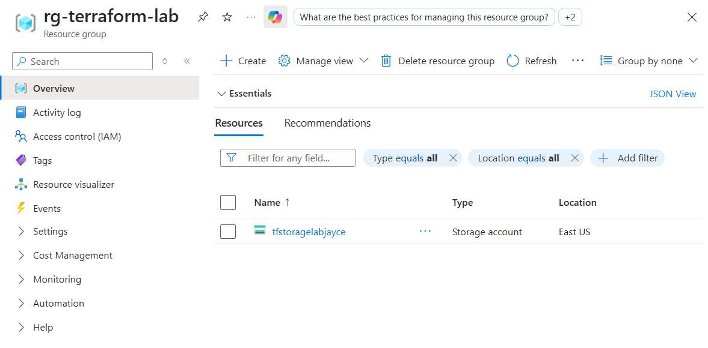

# Resource Group + Storage Account Lab

## Overview

This Terraform lab provisions core Azure infrastructure using declarative `.tf` files and CLI-based workflows. It deploys a Resource Group and a Standard LRS Storage Account to the East US region, reinforcing Infrastructure as Code (IaC) principles and hands-on alignment with AZ-104 and Terraform Associate certifications.

## Architecture

- **Azure Resource Group** for organizing cloud resources  
- **Azure Storage Account** (Standard LRS) for blob, file, and queue services  
- Terraform CLI for provisioning and state management  
- Modular `.tf` files for clean separation of logic and configuration

## Deployment Steps

1. Defined input variables in `variables.tf`  
2. Provisioned a resource group using `azurerm_resource_group`  
3. Created a storage account using `azurerm_storage_account`  
4. Verified deployment in Azure Portal

## Configuration Snapshot

### Deployment Confirmation  
Screenshot showing `rg-terraform-lab` and `tfstoragelabjayce` successfully deployed in Azure Portal.  

## Outcome

Successfully deployed and validated core Azure infrastructure using Terraform.  
This lab demonstrates cost-aware provisioning, variable abstraction, and clean IaC structure—ideal for portfolio visibility and certification reinforcement.

## Tools Used

- Microsoft Azure (Resource Groups, Storage Accounts)  
- Terraform CLI  
- GitHub for version control  
- Windows 11 (local dev environment)
